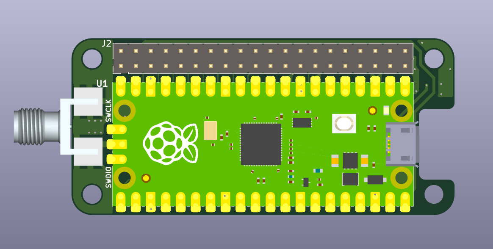
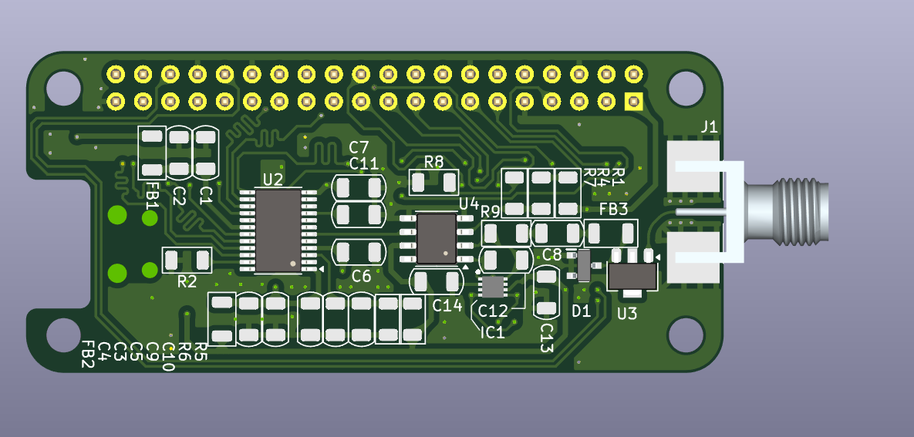

 

# An 8-bit, 100Msps ADC standalone pHAT

aka 0xA5EDED == sha1(pHATrick)

# Description

An 8-bit, 125Msps ADC standalone pHAT

More? @TODO

# What

__Beware - these need to be updated with actual assembled board. v2 includes sees top going bottom and vice versa.__

# Acquisition of a square/sine wave

Signal coming out of a cheap DSO, should be around square, 4MHz

### Acquisition 

### Spectrum of a square wave at 125Msps

# Changes from v1

* Remove i2c to something simpler - MCP40D17T
* Let user choose offset or not
* Check OPAMP capa to get a 60MHz cutoff
* BAV / MD0100 to be removed
* Putting the rp2040 under the board, to expose the beautiful art to users

# License

This work is based a previous TAPR exploration, the [pic0rick project](https://github.com/kelu124/pic0rick/) - these open hardware and software, developped with open-source elements as much as possible.

Copyright Luc Jonveaux (kelu124@gmail.com) 2024

* The hardware is licensed under TAPR Open Hardware License (www.tapr.org/OHL)
* The software components are free software: you can redistribute it and/or modify it under the terms of the GNU General Public License as published by the Free Software Foundation, either version 3 of the License, or (at your option) any later version.
* The documentation is licensed under a [Creative Commons Attribution-ShareAlike 3.0 Unported License](http://creativecommons.org/licenses/by-sa/3.0/).

## Disclaimer

This project is distributed WITHOUT ANY EXPRESS OR IMPLIED WARRANTY, INCLUDING OF MERCHANTABILITY, SATISFACTORY QUALITY AND FITNESS FOR A PARTICULAR PURPOSE. 

